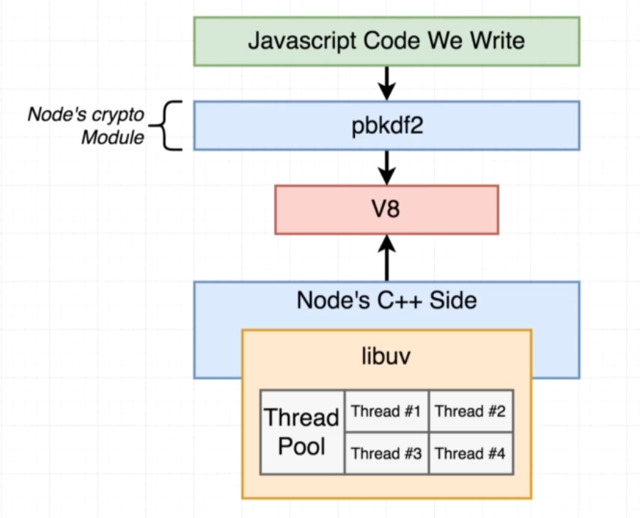
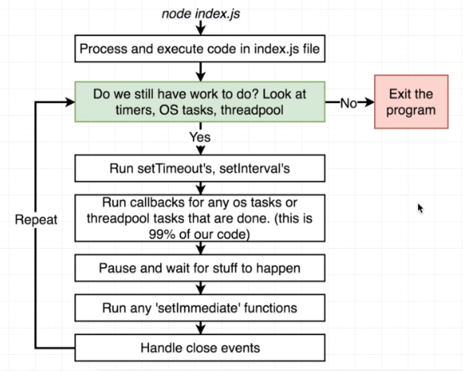

# Advanced Node.js part 1

## Node Internals


In the following diagram we can see the structure of the Node.js runtime and what node.js is built on behind the scenes.

On the first level we have the Javascript code itself, which on its own is just a Javascript code.

The second level is Node itself, which is running the JS code whenever we run `node` on the JS file above.

Node js itself has some dependencies which he requires in order to run the JS code inside a machine, which are the V8 engine and libuv.

V8 is an open source JS engine created by google. The main goal for this engine is to execute JS code outside the browser. This is the same engine that runs Javascript in the Chrome browser.

libuv is also an open source project that gives node access to the operating system's underline file system, it gives access to networking and also handles some aspects of concurrency.

So why don't we just use V8 or libuv directly and instead using node? The main reason is that both the V8 and libuv are using mainly C++ to run, but node.js encapsulate those abilities in a language that is easier to learn and which most of us understand: Javascript.
Node also provides wrappers and a unified and consistent APIs for various abilities for us to use, such as the `http`, `fs`, `crypto` and `path` modules. Most of those modules are powered by the libuv project which gives node access to the operating system.


## module implementation
In the "node internals" section above we understood what node.js is using under the hood to make it work as a runtime outside the browser.
Now we will take a look on how it uses those C++ functions inside the Javascript code of any internal module.

For this example we will take a look at the `Crypto` module. This module is using V8 engine under the hood, but the code itself that we import to our node.js code is written in Javascript.
So how does node use the V8's C++ code inside a Javascript file?

First we will look at a specific hash algorithm that is part of the `Crypto` module: the `pbkdf2` algorithm.

In order to use the `pbkdf2` function, we first need to import the `Crypto` module:

```javascript
const crypto = require('crypto');
```

Then we call the specific hash function:

```javascript
crypto.pbkdf2('a', 'b', 100000, 512, 'sha512', () => {
  console.log('Done');
});
```

If we take a look inside the source code of `pbkdf2` function which can be found [here](https://github.com/nodejs/node/blob/main/lib/internal/crypto/pbkdf2.js), we can see the declaration of the function `pbkdf2`:

```javascript
function pbkdf2(password, salt, iterations, keylen, digest, callback)....
```

And inside this function there is an instantiation of a class called `PBKDF2Job`. If we try to search for this class in the JS code we will not find it.
The reason is that this class is actually imported from the V8's C++ code. If we take a look at how it is being imported we will see this syntax:

```javascript
const {
  PBKDF2Job,
  kCryptoJobAsync,
  kCryptoJobSync,
} = internalBinding('crypto');
```

The `internalBinding` function is the one in charge of converting the C++ code found in V8/libuv to a JS code, and as we can see, the returned data from this `internalBinding` function for the `crypto` module was an object and JS is able to deconstruct it into specific keys.

This graph represents what we have learned so far regarding the connection between the C++ code to the JS code:


Note that on earlier versions of node, the `process.binding()` was the function used to convert between C++ to JS, but it was replaced by `internalBinding` in later versions.


## Basics of Threads
Whenever we run some programs on the computer, we start up something called a process. A process is an instance of a computer program that is being
executed.

Within a single process we can have multiple things called threads. A thread is basically like a to-do list with one or several instructions that need to be executed by the CPU of the computer.

The thread is given to the CPU, and the CPU will try to run those "to-do items" in the thread one by one. The order in which it will run those items is based on the order they are written in the code.

Each process can have multiple threads inside it. You can see the number of process and number of threads that are being used at the moment by opening the task manager of your operating system, and you will likely see that there are more threads than processes running.

You can see the structure of processes and threads in the following diagram:


Beside the "to-do" list inside the thread which represents what action to perform first, the operating system also have something called scheduling.
The scheduling system's responsibility is to decide which thread the CPU should process at any given time.

For example, let's say we have all those processes and threads that need to be processed:


The operating system's scheduler should now decide which threads are the most important to run first.

The scheduler knows which operations are more critical to process first, like in the example above, there is a thread that is responsible to
move the cursor after a user has moved the mouse, or a thread that will write letter to an input after a user has clicked a button on the keyboard.
Those processes are more urgent and should not wait for other processes to finish, so the user will not need to wait a couple of seconds just to see the cursor moves around the screen.

There are several strategies to maximize the amount of threads that can run simultaneously, so more processes can get executed at the same time.
For example, since the CPU is the one that is running the processes, we can add more CPU cores, and each core can handle a thread:


It's also possible that one core will process multiple threads at the same time using something that's called "multi-threading", but we will touch on that further along the course.

Another approach by the scheduler to maximize thread processing is to check any threads with I/O operations that might take time and pause those processes in order
to allow non-I/O processes to finish running, and then continue the paused I/O process:


An I/O (input/output) process takes time because the process requires other resources beside the CPU to run and return some output or alternatively, write some inputs into those external resources.
Since the CPU has no control over how long can it take, it can potentially block other processes (which some of them can be run faster using only the CPU) and that's why this approach is important in order to relieve any blocked processes.

An example for an I/O operation is reading a file's contents (like using the `fs` module), or writing to a database, which both of those things sit in an external resource (the hard-drive or from the internet).

## The Node Event Loop
In the last section we understood what is a thread and how it works on our computer.

In this section we will understand a thread is being used by the node.js program.

Whenever a new node program starts (usually by running `node` in the terminal), node automatically creates one thread and all the code is being executed in this single thread.

Inside that single node thread there is something called the "event loop". This event loop is basically a control structure made by node in order to decide what runs in that single thread:


This event loop is the core of every node program, and every node program that runs has only one event loop.

Understanding how the event loop works is crucial since a lot of performance concerns are tied to how this event loop works.

When running `node` on a file, before it starts the event loop, it will go over the code line by line and execute it. Then it will initiate the event loop.

The event loop is pretty much like a `while` loop that will execute any "tasks" given by the code. The main "tasks" that will be handled by the event loops are:

- Any pending setTimeout, setInterval or setImmediate functions (that didn't reach the ending point yet).
- Any pending OS tasks. For example, a server listening to a port which should keep the connection alive
- Any pending long-running operations, such as using the `fs` module or reading from a database.

As long as one of those "tasks" exist in the code execution, it will keep looping through the event loop. Each loop is called a "tick".

Inside each "tick", several things happen in a particular order that we should acknowledge:

1. First node looks at any pending timers (`setTimeout` and `setInterval`) and sees if any callback functions are ready to be called. For example if `setTimeOut` reached the last second.
2. Then node looks at any pending OS tasks (like reading a file using `fs`) and calls the callback functions if the task is done.
3. After than, node will pause execution for a bit and wait for any pending tasks or timers that might finish soon. This works different from a `while` loop, which runs very fast. In an event loop we get this "pause" that will make the loop not run as fast.
4. Next, node will run any `setImmediate` callbacks
5. Lastly, node will handle any `close` event callback functions. A close event is something that can be used in various occasions, for example when an `express.js` server closes, we can listen to a `close` event for the server and run a callback function.

When there are no more "tasks" to run with the event loop, the node program will stop and the event loop will be terminated until we run `node` again.

### Is Node.js actually single threaded?

As previously mentioned in the last diagram, seems like node runs only on a single thread, which means it only runs on one core of the CPU which might result in slow performance.

But that's not the whole truth; the node event loop does run on a single thread, but some node frameworks and Std lib code will run as multi-thread:


We can prove that node is not fully single-threaded by running this code:

```javascript
const crypto = require('crypto');

console.time('pbkdf2 1');
console.time('pbkdf2 2');
crypto.pbkdf2('a', 'b', 100000, 512, 'sha512', () => {
    console.timeEnd('pbkdf2 1');
});

crypto.pbkdf2('a', 'b', 100000, 512, 'sha512', () => {
    console.timeEnd('pbkdf2 2');
});
```

In this example, we have 2 `pbkdf2` hashes to run, and we take time for each of them to see how long does it take node to run them both.

If we run it and look at the terminal we can see a very similar result for both of them:

```bash
pbkdf2 1: 541.195ms
pbkdf2 2: 550.665ms
```

This is because node is asynchronous. If node was really single threaded, we would have to wait until `pbkdf2 1` to finish and only then it will start the `pbkdf2 2`, resulting in `pbkdf2 2` to result in a much higher milliseconds output than the first one.

But node does take advantage of multi-threading to run them both at the same time asynchronously. 

Let's look at what's happening behind the scenes regarding the multi-threading computations that happens when we run those two `pbkdf2` functions simultaneously:



As previously mentioned, the V8 engine will translate the function call of `pbkdf2` into the C++ actual implementation of the logic of this hash algorithm.
We also mentioned that `libuv` also takes action in the C++ side in order to take use of the underlying OS.

Beside handling the OS part, `libuv` has another responsibility when it comes to some very particular function in the node standard library.
For some (not all) node's standard library functions, like `pbkdf2`, node's C++ side and libuv decide to do expensive calculations outside the event loop entirely.
Instead, the use something called the `thred pool`.

The `thread pool` is a series of 4 threads that can be used to run computation-intensive tasks, such as the `pbkdf2` algorithm. By default, `libuv` creates 4 threads in this thread pool.
That means that in addition to the event loop thread, there are 4 more threads that can be used to offload expensive calculations that occur in the running application.

The reason some of these calculations, like `pbkdf2`, are not part of the event loop is because they take time. If they were part of the event loop, node wouldn't be able to run any code after that without waiting for the calculation to complete.
A calculation like `3+3` or assigning a value to a variable are very quick operations and would not need this extra threads to complete, and they would be a part of the event loop.

To summarize the `thread pool` section, the usage of this `thread pool` is to allow non-intensive calculations to run independently in the event loop without worrying about when will the heavy calculations finish running.

We can actually test that the `thread pool` only has 4 threads available. To do that we simply add 3 more `pbkdf2` calls along with timers:

```javascript
console.time('pbkdf2 1');
console.time('pbkdf2 2');
console.time('pbkdf2 3');
console.time('pbkdf2 4');
console.time('pbkdf2 5');

crypto.pbkdf2('a', 'b', 100000, 512, 'sha512', () => {
    console.timeEnd('pbkdf2 1');
});

crypto.pbkdf2('a', 'b', 100000, 512, 'sha512', () => {
    console.timeEnd('pbkdf2 2');
});

crypto.pbkdf2('a', 'b', 100000, 512, 'sha512', () => {
    console.timeEnd('pbkdf2 3');
});

crypto.pbkdf2('a', 'b', 100000, 512, 'sha512', () => {
    console.timeEnd('pbkdf2 4');
});

crypto.pbkdf2('a', 'b', 100000, 512, 'sha512', () => {
    console.timeEnd('pbkdf2 5');
});
```

When we run this code, we will actually see 4 calls ending at the same time while the fifth call is stalling for a bit:

```bash
pbkdf2 1: 610.885ms
pbkdf2 3: 636.451ms
pbkdf2 4: 658.164ms
pbkdf2 2: 660.68ms
pbkdf2 5: 1.135s
```

The reason is that the first 4 calls occupy the available 4 threads that the `thread pool` is using, while the fifth call doesn't have any available thread to go to, so it waits until one of the 4 calls finishes, and then it's being placed in the now free thread which only then it will get processed.

One thing worth noticing is that with 4 threads working, the time that it took to execute all of them was more than the time it took to only run 2 as seen above, while the fifth one took less time than the 4 before it. To understand why, let's look at this diagram:


This example shows what's happening behind the scenes. On the bottom we have our 5 function calls which 4 of them are instantly assigned to a thread pool.
The threads in the pool, with the help of the OS thread scheduler, are assigned to all the available cores of the CPU; 2 for the first core and 2 for the second core.
The CPU is able to perform multi-threading, allowing it to process the 2 threads per core simultaneously.

So why is it slower than only running 2 `pbkdf2` functions if it's running simultaneously?
The reason for that is because while the CPU runs them both at the same time, it's still double the work for the CPU since it needs to do more calculations simultaneously.
It's still faster than waiting for each one to finish, but it does require a little more time than running 1 `pbkdf2` function per core.

Since 4 of the `pbkdf2` functions finish running more or less at the same time, the fifth function has both the CPU cores free, meaning that the CPU doesn't need to perform any additional calculation rather than only calculate this one remaining function, and that's why it is faster than running 4 functions at the same time.

Note that this example refers to a CPU with only 2 cores. But a CPU with more cores will likely run the functions faster.

### Altering the Thread Pool

On default, the thread pool has 4 threads. We can change this by editing an environment variable called `UV_THREADPOOL_SIZE` at the top of the JS file:

```javascript
process.env.UV_THREADPOOL_SIZE = 2;
```

Now, the `libuv` only creates a thread pool of only 2 threads when running those computing-intensive functions.

We can see the effect of only have 2 threads in the thread pool by running the same code we ran earlier with the 5 `pbkdf2` functions.
If earlier we saw that it ran 4 functions in more or less the same time, now we can see that it will run only 2 at the same time:

```bash
pbkdf2 1: 646.013ms
pbkdf2 2: 689.387ms
pbkdf2 3: 733.729ms
pbkdf2 4: 773.15ms
pbkdf2 5: 1.176s
```

We can see the time difference of #1 and #2 VS #3 and #4, and also #5.

We can see what is happening with this diagram:


First the #1 and the #2 calls are assigned to the thread pool and then get processed in core #1 and core #2 respectively.
After they are finished, the #3 and the #4 calls are taking the place the calls #1 and #2 and so on...

We can also set the thread pool to have 5 threads. This should result in all the calls to finish at the same time even though it will require 1 core to have 3 running threads simultaneously (for a 2 CPU core computer).
This will result in the overall calls to take a bit longer, but it will execute all the calls at the same time. 

## OS Operations

So far we've seen how thread pool works. But in some the full control goes over to the OS itself.

The most common example is doing `http` requests with node. Neither node nor libuv are able to actually send a network request from the OS, so libuv delegates this operation to the OS,
And by doing so something interesting happens. Let's take this code for example:

```javascript
const https = require('https');

const start = Date.now();

function doRequest() {
    https.request('https://www.google.com', res => {
        res.on('data', () => {
        });
        res.on('end', () => {
            console.log(Date.now() - start);
        });
    }).end();
}

doRequest()
doRequest()
doRequest()
doRequest()
doRequest()
doRequest()
```

In this example we run asynchronized requests to google.com. Keep in mind that the `UV_THREADPOOL_SIZE` is not changed so there should be only 4 thread pools available.

The interesting thing that is happening is that all of those requests finish simultaneously, or very close to each other:

```bash
393
402
406
408
431
436
```

That's because the OS itself manages how the threading will be used, and we are not bound to the amount of threads in the pool thread.

In this diagram we can see the flow for OS operations such as `http` requests:


In general, all the networking side of node is done by the OS itself, whether if it's sending `http` requests or listening to a port.

As a quick reminder, this operation is still part of the event loop, and until the operation is complete (in `http` case, when the request returned a response),
the event loop will keep node running. The OS delegation is part of the "pending OS tasks" that we talked about in the "event loop" section.

## Summarization

When we run a `.js` file with node, node will automatically execute this file and every file that is required inside that file.
Node then enters the event loop. The event loop checks if there is anything left to process. If it finds something to process then it goes through
all the possible operations. We can see the full "tick" of the event loop in this diagram:



## Weird Node Behavior

In the following example, we are going to run multiple operations in one single node file, and we are going to see a strange behavior when we run this file:

```javascript
const https = require('https');
const crypto = require("crypto");
const fs = require('fs');

const start = Date.now();

function doRequest() {
    https.request('https://www.google.com', res => {
        res.on('data', () => {
        });
        res.on('end', () => {
            console.log("request: ", Date.now() - start);
        });
    }).end();
}

function doHash() {
    crypto.pbkdf2('a', 'b', 100000, 512, 'sha512', () => {
        console.log("Hash: ", Date.now() - start);
    });
}

doRequest();

fs.readFile('multitask.js', () => {
    console.log("FS: ", Date.now() - start);
});

doHash();
doHash();
doHash();
doHash();
```

You can see that we are doing several operations:
1. doing an `http` request
2. reading a file with `fs`
3. doing multiple hashes with `pbkdf2` function

Usually, when we use the `fs` to read a small file, it should take around 30 milliseconds or os. But if we run our code now, this is the result we are getting:

```bash
request:  419
Hash:  637
FS:  638
Hash:  644
Hash:  647
Hash:  672
```

The `fs` took 638 milliseconds.

If we remove the hash usage and only keep the `fs` and request running, we get the following result:

```bash
FS:  28
request:  431
```

Why does it take so much time to read a file from the hard-drive when we also run the `pbkdf2` hashing algorithm?
Also, why we will always see one hash completed before the `fs`. And why does the request finish first on every run?

This diagram is the key to answer those questions:


As we know, the hashing algorithm uses the thread pool and `fs` also uses the thread pool, while the request does not and instead is using the OS itself to run.
That's explaining why the request will always finish first.

So why it takes relatively long time to run all the hashes and the `fs` call? Let's look at what the `fs` is doing behind the scene when we use it to read a file:


One thing we can see here, is that in the event loop there was actually 2 pauses for the file read. First, `fs` tries to get 
stats on the requested file from the hardware (this is one pause until response from hardware arrives) and second, it tries to
actually read the file (second pause until contents arrives from hard drive).

Since there are 4 threads in the thread pool, first one starts to work with the `fs` call since it was the first one that we called in the file, and the other 3
work on the hashes (note that one hash is waiting to be processed). The `fs` thread needs a response from the hard-drive while the other threads can 
be processed right away since those are hashes that can be calculated by the CPU.

So what happens is that the first thread that was handling the `fs` frees itself up since it has nothing to do but wait for the hard drive to finish,
so that results in the 4th hash to enter to that thread and get processed by the CPU instead of the `fs` which is now idle.
In the meantime, one of the hashes has already finished and is being printed to the console, which frees up one thread.
That one thread that is now free, sees that the `fs` is waiting for the hard drive, so this thread is continuing the work on the `fs`,
which was asking the hard drive for statistics. When the hard drive returns the statistics, it can now move on to ask the hard drive
for the actual content, and since there is no more work to do, it keeps the `fs` on it until it receives a response from the hard drive and then the console log for the `fs` appears.

Then all the other hashes finish their work and get print to the screen. 
This explains why the `fs` takes more time than usual when there are more processes that fully crowd the thread pool. Since
between hard drive calls there were other processes that were blocking the thread pool, the `fs` was idling until one of the hashes finish.

We can visualize it even further and add a new hash call (totaling in 5 hash calls). Since there are two pauses in reading the file (stats and actual read),
the `fs` thread will free itself up 2 times before actually finishing, resulting in 2 hashes that must finish before the `fs` can finish:

```bash
request:  396
Hash:  635
Hash:  644
FS:  645
Hash:  646
Hash:  667
Hash:  1142
```

If we were to have 4 hash calls and one `fs` call, just like before, and we will also set the `process.env.UV_THREADPOOL_SIZE = 5;` at the start of the file,
we should see that the `fs` does finish first, since there are no other tasks that need more threads, so the `fs` thread can keep questioning the hard drive and not pause the `fs` process.


