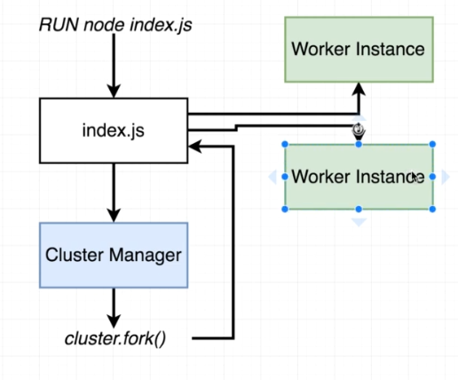

# Node Clustering

Node.js is a single threaded runtime, meaning that only one thread of the CPU is able to process the execution of the code.

We can't actually change Node.js to work as a multi-threaded software, but what we can do is run multiple instances of Node
on a single thread, which will act similar to multithreading in a sense that multiple executions of Node can happen at once on the same machine.

An example for why this is useful is if we try to block the event loop for several seconds like so:

```javascript
const express = require('express');
const app = express();

function doWork(duration) {
  const start = Date.now();
  while (Date.now() - start < duration) {}
}

app.get('/', (req, res) => {
    doWork(5000);
    res.send('Hello World!');
});

app.listen(3000, () => {
    console.log('app listening on port 3000!');
});
```

If we access the "/" path we will wait 5 seconds until it loads, but any other requests in between will have to wait those 5 seconds
of the first run until it can start to process its own 5 seconds wait.

That's because this is pure Node event-loop work, we aren't using any operating system workers here, and we utilize 100%
of the event loop in this one request, which causes any additional requests to wait until the event loop frees up.

If we had a cluster of multiple Node instances, each one would have its own event loop, which can be utilized in any additional requests.

### So how does clustering work?

In order to utilize the clustering in Node, we first need to set up multiple Node processes on the machine.

On top of all the Node processes, we will have a Cluster Manager. The cluster manager is responsible in monitoring the health
of all the running Node processes. The cluster manager will not run any Node code itself, but will monitor all the instances
of Node that will run the application.

Basically, the cluster manager can stop, start, restart do and other administrative operations on the Node instances.

When using Node cluster, we will still call the node script as usual, for example by running ```node indexWithCluster.js```, but instead
of simply executing the script, it will first run the cluster manager, which will then assign the command execution to one
of the Node processes.

Here is a diagram with an example on how it works in general:



First we run the command as usual. Then the cluster manager takes action and assigns the call to a "worker instance". 
To do that, the cluster manager uses a Node standard library called ```cluster```, and uses the function ```fork()``` as a way to 
create and assign the call to a node instance, which then executes the actual ```indexWithCluster.js``` inside that Node instance.

To start demonstrating how clustering works, we will start to add some cluster code to the top of our ```indexWithCluster.js``` file:

```javascript
const cluster = require('cluster');

console.log(cluster.isMaster);
```

We first import the ```cluster``` library from Node (remember, this is a standard library, no need to install it. It comes with Node).

Regarding the second line: ```console.log(cluster.isMaster);```, if you recall, it was just mentioned that when we first execute a Node script that is using cluster,
it will still run the script for the first time as usual. When it does that, it runs the cluster manager instance which will then
fork (create) a new node instance and will execute the script in this instance.

When we run it for the first time in the cluster manager instance, the ```cluster.isMaster``` will be set to true. That is not the
case when the code runs on any of the forked instances that the cluster manager created.

Knowing whether we are in a "master" instance or not is important, because we will need to have different logic in the code
depending on the case:

```javascript
if (cluster.isMaster) {
    cluster.fork();
    return;
}

const express = require('express');
const app = express();

function doWork(duration) {
  const start = Date.now();
  while (Date.now() - start < duration) {}
}
.
.
.
```

In this case, when we run the code and are in the "master" instance, we should tell Node to fork a new child instance.
After the child instance is forked (created), the file is being called once again, but this time the ```cluster.isMaster```
will return false; in this case, we want to run our actual code which is everything below the if statement of the ```cluster.isMaster```.

We can see that this is the case if we output the "isMaster" value at the start of the file. We will see the following result in the terminal:

```bash
true
false
app listening on port 3000!
```

We can also control how many times the program will execute each time we call the ```node indexWithCluster.js``` command, by adding more forks:

```javascript
if (cluster.isMaster) {
    cluster.fork();
    cluster.fork();
    cluster.fork();
    cluster.fork();
    return;
}
```

Now, if we run our code in the terminal this is the output we will see for ```console.log(cluster.isMaster);```:

```bash
true
false
false
false
false
app listening on port 3000!
app listening on port 3000!
app listening on port 3000!
app listening on port 3000!
```

Why do we want to have multiple forks? The reason is that without creating multiple forks, the Node process will run the same as
running it without any clustering, since it's using only one instance of Node.

By forking the instances multiple time, any requests that are blocking the I/O will be in once instance while the other requests
will work on a different instance.

We can take for example our previous example of the blocking code we wrote and add a new endpoint that is fast. Previously if
we had tried that without the clustering, the fast request will have to wait until the blocking request would finish running
and only then will it process the fast request.

```javascript
app.get('/', (req, res) => {
    console.log("slow worker id:" + cluster.worker.id);
    doWork(5000);
    res.send('Hello World!');
});

app.get('/fast', (req, res) => {
    console.log("fast worker id:" + cluster.worker.id);
    res.send('This was fast!');
});
```

If we would to run both of this requests at the same time, the ```/``` request will block the process for 5 seconds, making the ```/fast```
request wait for it as well and only then it would get processed.

By having multiple forks the ```/fast``` request can run independently and will avoid waiting those 5 seconds.

We also added an output that will show us what workers (forks) each of the requests use. If it works correctly, the ```/``` request
will show one worker and the ```/fast``` request will show a different worker (given that they are both running simultaneously).

```Note: some OSs work differently with Node clustering. In windows both the / and /fast may get assigned the same worker and therefore the /fast might get stuck until / is finished. Usualy if we add a second /fast2 endpoint and also run it with the first two, it will get assigned to a different worker and will work fast.```

When forking a Node instance, this instance will be assigned to a CPU that doesn't already have a Node instance running on it.
In practice, we can assign more workers than there are CPUs on the machine, but the best practice is to fork an amount of
child processes that matches the amount of CPUs on the machine.

The reason is that if we try to assign more workers than CPUs, each CPU is going to work harder on processing each request since it needs
to "juggle" between multiple Node processes, and it will have a harder time focusing on just one process. This may result in each 
individual Node process to take more time than if were to run it only once with no clustering at all.

To check how many CPUs does your machine has and assign child processes accordingly, we can use the ```os``` standard library
in Node which has access to numerous properties of the operating system, including the CPU:

```javascript
if (cluster.isMaster) {
    const cpuCount = require('os').cpus().length;

    // Create a worker for each CPU
    for (let i = 0; i < cpuCount; i++) {
        cluster.fork();
    }

    return;
}
```

### PM2

We previously discussed how the master Node instance is responsible for the health of the children processes, including starting or closing them,
restarting them whenever they crash and more. All those stuff are things that we need to write ourselves in the code in order 
to achieve this level of maintenance.

Fortunately, we can avoid writing all this logic ourselves and instead, we can use an open-source library called PM2 (official guide can be found [here](https://github.com/Unitech/pm2) and documentation for cluster mode with PM2 can be found [here](https://pm2.keymetrics.io/docs/usage/cluster-mode/)).
This library will be able to manage all that stuff for us automatically with a bit of setup beforehand.

To understand how to use it, we will first need to install it on the machine:

```npm install -g pm2```

The ```-g``` represents "globally" which means we are installing it on the machine itself rather than on this specific project.

Run ```pm2 -h``` to check that it was installed successfully.

Since we will let PM2 handle all the cluster work, we should not write any clustering code in our JS files as shown above.
PM2 does all that for us in the background.

Now that PM2 is installed, we can use it on our project with this command:

```
pm2 start indexWithoutCluster.js -i 0
```

This tells PM2 to run our file, which in this case is ```indexWithoutCluster.js```. We also pass the ```-i``` parameter with a
value of 0. The ```-i``` parameter tells PM2 what logic of instancing we want it to do. In this case, 0 (or "max") is the option
that tells PM2 to assign a child process for each of the logical cores on the machine (logical core is the amount of physical CPU's * the amount of threads of each of them).

To read more about the options for the ```-i``` parameter check the cluster guide on [PM2 website](https://pm2.keymetrics.io/docs/usage/cluster-mode/).

If everything works correctly you should see something like that in your terminal (note that the amount of instances may vary depends on your machine):

```bash
┌─────┬────────────────────────┬─────────────┬─────────┬─────────┬──────────┬────────┬──────┬───────────┬──────────┬──────────┬──────────┬──────────┐
│ id  │ name                   │ namespace   │ version │ mode    │ pid      │ uptime │ ↺    │ status    │ cpu      │ mem      │ user     │ watching │
├─────┼────────────────────────┼─────────────┼─────────┼─────────┼──────────┼────────┼──────┼───────────┼──────────┼──────────┼──────────┼──────────┤
│ 0   │ indexWithoutCluster    │ default     │ 1.0.0   │ cluster │ 23340    │ 2s     │ 0    │ online    │ 0%       │ 37.9mb   │ kshay    │ disabled │
│ 1   │ indexWithoutCluster    │ default     │ 1.0.0   │ cluster │ 16232    │ 2s     │ 0    │ online    │ 0%       │ 38.1mb   │ kshay    │ disabled │
│ 2   │ indexWithoutCluster    │ default     │ 1.0.0   │ cluster │ 2944     │ 2s     │ 0    │ online    │ 0%       │ 37.6mb   │ kshay    │ disabled │
│ 3   │ indexWithoutCluster    │ default     │ 1.0.0   │ cluster │ 26576    │ 2s     │ 0    │ online    │ 0%       │ 37.6mb   │ kshay    │ disabled │
│ 4   │ indexWithoutCluster    │ default     │ 1.0.0   │ cluster │ 26140    │ 2s     │ 0    │ online    │ 0%       │ 37.6mb   │ kshay    │ disabled │
│ 5   │ indexWithoutCluster    │ default     │ 1.0.0   │ cluster │ 19984    │ 2s     │ 0    │ online    │ 0%       │ 37.5mb   │ kshay    │ disabled │
│ 6   │ indexWithoutCluster    │ default     │ 1.0.0   │ cluster │ 25648    │ 2s     │ 0    │ online    │ 0%       │ 37.9mb   │ kshay    │ disabled │
│ 7   │ indexWithoutCluster    │ default     │ 1.0.0   │ cluster │ 26868    │ 2s     │ 0    │ online    │ 0%       │ 37.5mb   │ kshay    │ disabled │
│ 8   │ indexWithoutCluster    │ default     │ 1.0.0   │ cluster │ 18612    │ 1s     │ 0    │ online    │ 0%       │ 37.7mb   │ kshay    │ disabled │
│ 9   │ indexWithoutCluster    │ default     │ 1.0.0   │ cluster │ 13216    │ 1s     │ 0    │ online    │ 0%       │ 37.7mb   │ kshay    │ disabled │
│ 10  │ indexWithoutCluster    │ default     │ 1.0.0   │ cluster │ 17508    │ 1s     │ 0    │ online    │ 0%       │ 37.5mb   │ kshay    │ disabled │
│ 11  │ indexWithoutCluster    │ default     │ 1.0.0   │ cluster │ 26856    │ 1s     │ 0    │ online    │ 0%       │ 37.5mb   │ kshay    │ disabled │
└─────┴────────────────────────┴─────────────┴─────────┴─────────┴──────────┴────────┴──────┴───────────┴──────────┴──────────┴──────────┴──────────┘
```

PM2 runs in the background, so in order to check the health and status of the currently running processes of PM2 we can use the command:

```pm2 list```

This will show the same table that was prompted when we started the server with ```pm2 start...```.

We can also get a more detailed report on the current status of one of the servers that run on PM2 (currently we only have 1 server which is the 
```indexWithoutCluster```):

```pm2 show indexWithoutCluster```

Another option to monitor a specific instance  is by running:

```pm2 monit```

This will open a window on the console that will allow us to iterate over all the workers and view logs and data about each of them.

To kill a specific server you can run ```pm2 delete indexWithoutCluster``` or if you just want to momentarily stop the server 
you can run ```pm2 stop indexWithoutCluster```.

Note that usually PM2 is used in a production environment where you need the concurrency of requests. In your development environment usually you
won't need clustering due to low request volumes, but you can still use it and test that it works as expected.

